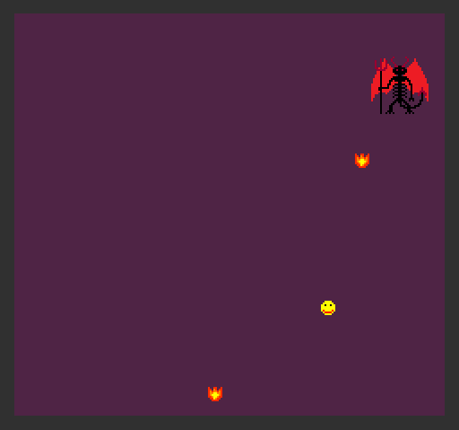

# I Hate Fireballs

Author: Jacky Sun

Design: Player will need to dodge fireballs launched by a demon or suffer LETHAL consequences.

Screen Shot:

How Your Asset Pipeline Works:

1. I create png assets from pixilart.com.
2. I use the load_png function to load my pngs in as cpp vector of colors
3. For each png asset, I made a separate 2*2 pallate png just for the code to read colors into a PPU466 pallate.
4. Loop through color vectors and correctly set the bitmaps of associated Tiles using bit operations.
5. For assets that need multiple tiles, there is additional handling in step 4's loops to account for tile offset and assembly.
6. Finally in draw() I just need to associate sprites with my custom tiles through the ppu tile table.

You can find all of the assets used here: [link](Assets/)

How To Play:

Use arrow keys to move player sprite.

This game was built with [NEST](NEST.md).

